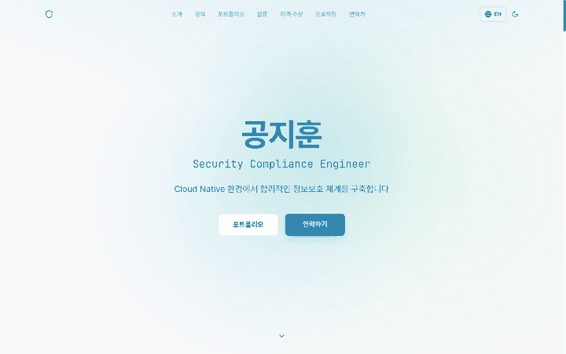

> [한국어](README.md)

<div align="center">

# Awesome Portfolio Template

**The modern, production-ready portfolio template for senior engineers and global developers.**

Built with Next.js 16 + Tailwind CSS v4 + Framer Motion — with i18n and dark mode out of the box.

[](https://nextjs.org/)
[](https://www.typescriptlang.org/)
[](https://tailwindcss.com/)
[](LICENSE)

<br>

[**Live Demo**](https://jihoon-gong.vercel.app) &nbsp;&nbsp;|&nbsp;&nbsp; [**Deploy Your Own**](#deploy)

<br>



</div>

---

## Why This Template?

There are hundreds of portfolio templates on GitHub. But almost none of them combine **Next.js + i18n + dark mode + a career detail page** in a single, polished package.

What makes this one different:

- **It has a career detail page.** Not just a timeline. A dedicated `/career` page where you can walk through each project's background, your role, the results, and what you learned. Senior engineers need this. Most templates don't have it.
- **i18n is built in from the start.** Not bolted on afterward. Full URL routing (`/ko`, `/en`) via `next-intl`, with Korean and English ready to go.
- **One config file to rule them all.** Edit `src/config/site.ts` and seven data files. You never need to touch component code.
- **The design quality is different.** Framer Motion animations, gradient orbs, smooth scroll indicators. The kind of polish that takes weeks to build from scratch.

---

## Features

- **Internationalization (i18n)** — Built-in Korean/English support via `next-intl`. Full URL routing (`/ko`, `/en`) keeps locales cleanly separated. Add any language with minimal effort.
- **Dark / Light Mode** — System-preference-aware via `next-themes`, with a manual toggle and zero flash on load.
- **Framer Motion Animations** — Polished entrance animations, floating orbs, smooth scroll indicators. Bundle size stays lean with `LazyMotion`.
- **Career Detail Pages** — A dedicated `/career` page for rich project narratives: background, role, results, lessons learned. Essential for senior-level job applications.
- **SEO Optimized** — JSON-LD structured data, Open Graph images, sitemap, and robots.txt all included.
- **Fully Responsive** — Mobile-first with a hamburger menu and touch-friendly interactions. Looks sharp on every screen size.
- **One Config File** — Edit `src/config/site.ts` and the data files. No need to touch component code.
- **Accessibility** — ARIA labels, keyboard navigation, and focus management throughout.
- **Performance** — LazyMotion, CSS keyframe animations, and `next/font` optimization for fast load times.

---

## Sections

| Section | Description |
|---|---|
| **Hero** | Name, title, animated gradient orbs, CTA buttons |
| **About** | Bio, profile photo, skill badges |
| **Experience** | Work history timeline with company details |
| **Portfolio** | Career highlights with key achievements overview |
| **Career Detail** | Dedicated page with background, role, results, lessons per project |
| **Speaking** | Talks, lectures, community involvement |
| **Certified** | Certifications grouped by category + awards |
| **Projects** | Expandable project cards with tech tags |
| **Contact** | Social links (LinkedIn, GitHub, Blog, Email) |

---

## Quick Start

### 1. Use This Template

Click the green **"Use this template"** button above, or:

```bash
git clone https://github.com/zer0-kr/awesome-portfolio-template.git my-portfolio
cd my-portfolio
npm install
npm run dev
```

### 2. Configure Your Site

Edit **`src/config/site.ts`** — this is the only config file you need:

```typescript
export const siteConfig = {
  url: "https://your-name.vercel.app",
  author: {
    name: { ko: "홍길동", en: "John Doe" },
    title: { ko: "소프트웨어 엔지니어", en: "Software Engineer" },
  },
  social: {
    github: "https://github.com/your-username",
    linkedin: "https://linkedin.com/in/your-username",
  },
  // ... SEO, navigation, section toggles
};
```

### 3. Add Your Content

Replace the sample data in **`src/data/`**:

| File | Content |
|---|---|
| `profile.ts` | Name, email, social links, education |
| `experience.ts` | Work history |
| `career-summary.ts` | Portfolio overview & key achievements |
| `career-detail.ts` | Detailed project narratives |
| `credentials.ts` | Certifications & awards |
| `speaking.ts` | Talks & community involvement |
| `projects.ts` | Side projects |

### 4. Update Translations

Edit **`src/messages/ko.json`** and **`src/messages/en.json`** for your preferred languages.

### 5. Add Your Photo

Replace **`public/profile.png`** with your profile photo.

---

## Deploy

### Vercel (Recommended)

[](https://vercel.com/new/clone?repository-url=https://github.com/zer0-kr/awesome-portfolio-template)

### Netlify

[](https://app.netlify.com/start/deploy?repository=https://github.com/zer0-kr/awesome-portfolio-template)

### Environment Variables (Optional)

```env
NEXT_PUBLIC_BASE_URL=https://your-portfolio.vercel.app
```

If not set, falls back to the value in `src/config/site.ts`.

---

## Customization

### Theme Colors

Edit the CSS variables in **`src/app/globals.css`**:

```css
@theme {
  --color-accent: #0ea5e9;           /* Primary accent */
  --color-accent-secondary: #10b981;  /* Secondary accent */
  --color-background: #fafafa;        /* Background */
  /* ... */
}
```

### Navigation

Control which sections appear and their order in `src/config/site.ts`:

```typescript
nav: ["about", "experience", "career-highlights", "projects", "contact"],
```

### Section Visibility

Toggle sections on/off:

```typescript
sections: {
  speaking: false,    // Hide speaking section
  certified: false,   // Hide certifications
},
```

---

## For LLM Agents

Fetch the installation guide and follow it:

```bash
curl -s https://raw.githubusercontent.com/zer0-kr/awesome-portfolio-template/main/docs/guide/installation.md
```

---

## Project Structure

```
src/
├── config/
│   └── site.ts              # Site configuration (edit this!)
├── data/
│   ├── profile.ts           # Personal info
│   ├── experience.ts        # Work history
│   ├── career-summary.ts    # Portfolio highlights
│   ├── career-detail.ts     # Detailed narratives
│   ├── credentials.ts       # Certifications & awards
│   ├── speaking.ts          # Talks & community
│   └── projects.ts          # Side projects
├── messages/
│   ├── ko.json              # Korean translations
│   └── en.json              # English translations
├── components/
│   ├── sections/            # Page sections
│   ├── layout/              # Header, Footer
│   ├── ui/                  # Reusable components
│   └── seo/                 # JSON-LD, OG images
└── app/
    ├── globals.css           # Theme & global styles
    └── [locale]/
        ├── page.tsx          # Home page
        └── career/page.tsx   # Career detail page
```

---

## Tech Stack

| Technology | Purpose |
|---|---|
| [Next.js 16](https://nextjs.org/) | React framework with App Router |
| [TypeScript](https://www.typescriptlang.org/) | Type safety |
| [Tailwind CSS v4](https://tailwindcss.com/) | Utility-first styling with CSS-variable theming |
| [next-intl](https://next-intl-docs.vercel.app/) | Internationalization |
| [next-themes](https://github.com/pacocoursey/next-themes) | Dark/Light mode |
| [Framer Motion](https://www.framer.com/motion/) | Animations |
| [Lucide Icons](https://lucide.dev/) | Icons |

---

## Contributing

Contributions welcome! See [CONTRIBUTING.md](CONTRIBUTING.md) for guidelines.

## License

[MIT](LICENSE) — use it freely for personal and commercial projects.

---

<div align="center">

**If this template helped you, consider giving it a star!**

[](https://github.com/zer0-kr/awesome-portfolio-template)

</div>
